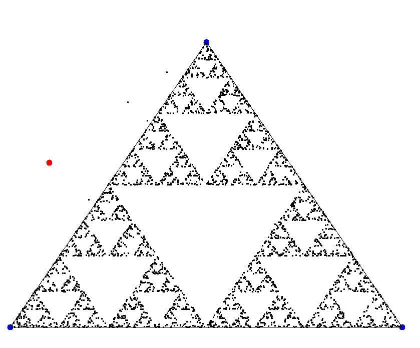

 
# Drawing a Sierpiński triangle with random numbers

This is a small script from my school days, which draws a [Sierpiński triangle](https://en.wikipedia.org/wiki/Sierpi%C5%84ski_triangle) using random numbers.

This is a well known example of a [chaos game](https://en.wikipedia.org/wiki/Chaos_game). Using turtle, it produces a Sierpiński triangle, which is a nice looking fractal.

This script (without some enhancements) was created at a course at the ["Mathematische Schülergesellschaft Leonhard Euler"](http://didaktik.mathematik.hu-berlin.de/de/schule/msg-schuelergesellschaft) some years ago.

### Troubleshooting

To get it to work, I had to do some searching.
These links may help you.
- On installing turtle: [ERROR: Command errored out with exit status 1: python setup.py egg_info Check the logs for full command output.](https://www.programmersought.com/article/6960452148/)
- [ImportError: libtk8.6.so: cannot open shared object file: No such file or directory](https://stackoverflow.com/questions/48504746/importerror-libtk8-6-so-cannot-open-shared-object-file-no-such-file-or-direct)
